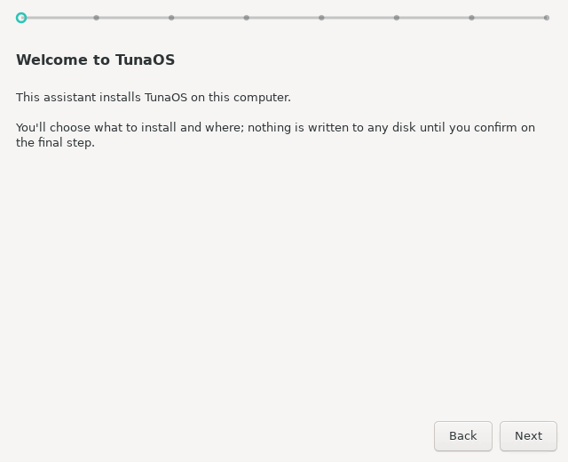

# TunaOS XFCE Installer — GTK3 frontend for fisherman

<p align="center">
  
</p>

<p align="center">
  <em>Every frame is generated in CI from the real wizard — see the
  <a href="docs/gui-walkthrough.md">step-by-step walkthrough</a>.</em>
</p>

Classic GTK3/PyGObject wizard that drives the
[fisherman](https://github.com/projectbluefin/fisherman) bootc install
backend. The plainest of the TunaOS installer frontends by design — see
`DESIGN.md` (the trawl line is the entire brand budget) and the
[shared installer frontend contract](https://github.com/tuna-os/tunaos/blob/main/docs/INSTALLER-FRONTENDS.md).

## Flow

Welcome → Source (image catalog, offline badges, live-ISO self-install) →
Destination → Filesystem & encryption → Identity → Confirm → Progress → Done.

Offline installs: detects live-ISO mode via `bootc status` (empty `image` in
the recipe installs the running system) and probes embedded OCI stores
(`/etc/tuna-installer/offline-stores`, `$TUNA_OFFLINE_STORES`,
`/usr/share/tuna-installer/oci-store`), passing them as
`additionalImageStores`.

## Run (development)

```bash
# Dependencies (Fedora)
sudo dnf install -y python3-gobject gtk3

./tuna-installer-xfce
```

Outside a Flatpak it invokes `sudo /usr/local/bin/fisherman`; inside it uses
`flatpak-spawn --host pkexec /usr/local/bin/fisherman` (polkit action
`org.tunaos.Installer.install` must be installed on the host by the ISO
build).

## Testing

Run unit tests via `pytest`:

```bash
pytest tests/
```

Or via Python's built-in `unittest`:

```bash
python3 -m unittest discover tests/
```

Headless GUI screenshot capture and verification:

```bash
python3 tests/gui/capture-screens.py docs/screenshots
```

## Contributing

Please see [CONTRIBUTING.md](CONTRIBUTING.md) for local setup, testing workflows, and PR submission guidelines.

## Flatpak

```bash
flatpak-builder --user --install --force-clean build \
  flatpak/org.tunaos.InstallerXfce.json
flatpak run org.tunaos.InstallerXfce
```

Runtime is `org.gnome.Platform` (ships GTK3 + PyGObject; the app uses no
libadwaita and follows the system GTK theme).

## License

GPL-3.0-only

