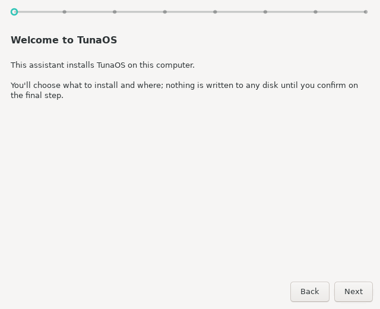
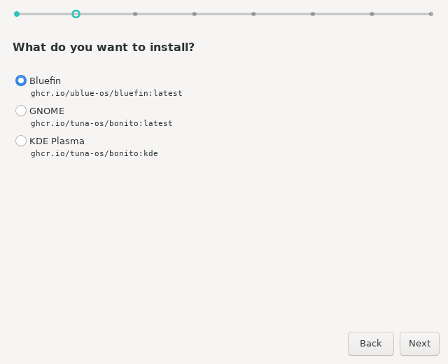
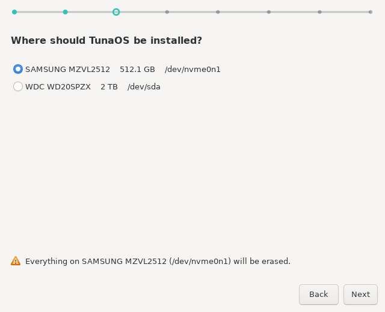
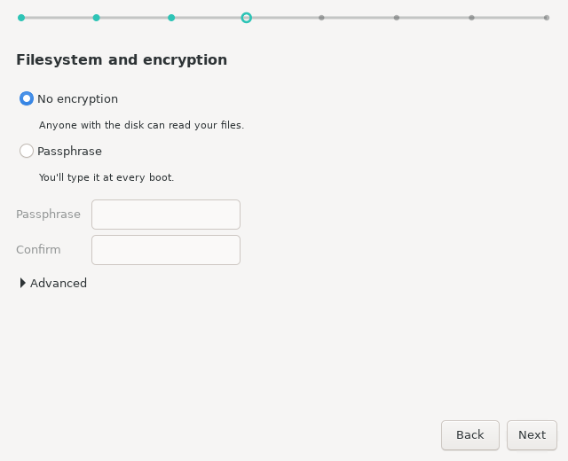
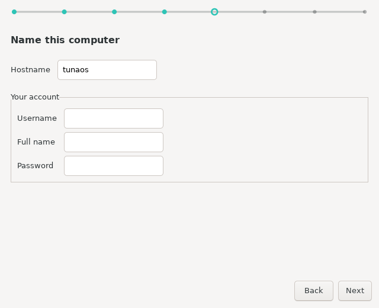
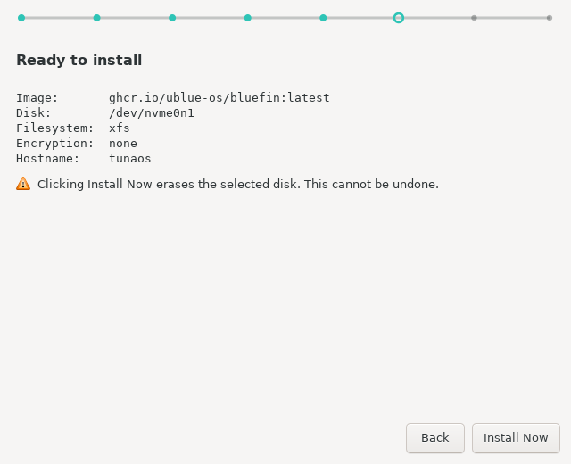
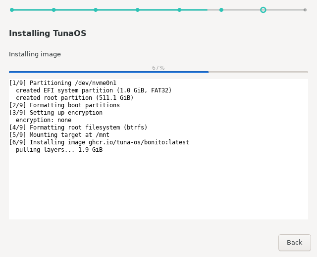
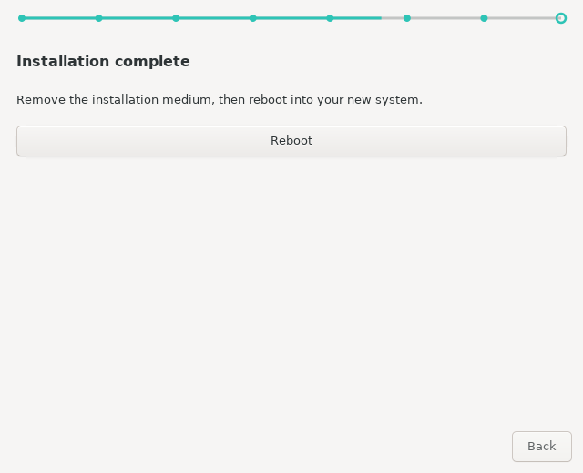

# Installing TunaOS with the XFCE installer — a walkthrough

This is what the installer looks like, screen by screen. Every image on this
page is generated in CI from the real GTK3 wizard by
`tests/gui/capture-screens.py`, so it cannot drift from the app the way
hand-taken screenshots do.

The capture runs headless under Xvfb against fixtures — a canned image catalog
and a canned `lsblk` — so it never touches a real disk and the output is
reproducible.

---

## 1. Welcome



Nothing is written to any disk until you confirm on the final step. The dotted
line across the top is the progress indicator for the whole wizard.

## 2. What to install



Each entry is a bootc image. The tree groups variants under their base image,
so picking a desktop is one choice rather than a search through tags.

## 3. Where to install it



Only real, non-removable disks are offered, and the live medium you booted from
is excluded — so the installer will not offer to overwrite itself.

## 4. Filesystem and encryption



The passphrase fields stay disabled until you choose an option that needs one.
Filesystem and btrfs subvolume layout live under **Advanced**, because the
default is right for nearly everyone.

## 5. Your account



The computer name becomes the hostname. The account created here is an
administrator on the new system.

## 6. Confirm



The last screen before anything is written, and the only one whose button is
styled as destructive. Everything above this point is reversible by quitting.

## 7. Installing



The log is visible by default — XFCE users want the output. The step label and
progress bar are driven by fisherman's own `[n/9]` markers rather than a timer,
so the bar reflects real progress rather than an estimate.

## 8. Done



Remove the installation medium, then reboot into the new system.

---

## Regenerating these

```sh
sudo apt-get install -y python3-gi python3-gi-cairo gir1.2-gtk-3.0 xvfb imagemagick
xvfb-run -a python3 tests/gui/capture-screens.py docs/screenshots
```

The script reads its own output back and fails if a screen did not really
render — too few distinct colours, a near-uniform flat fill, or no text. That
check exists because a capture rig which only asserts its PNGs *exist* will
happily publish blank pages: the files are present and non-empty, and the
pages are empty.
